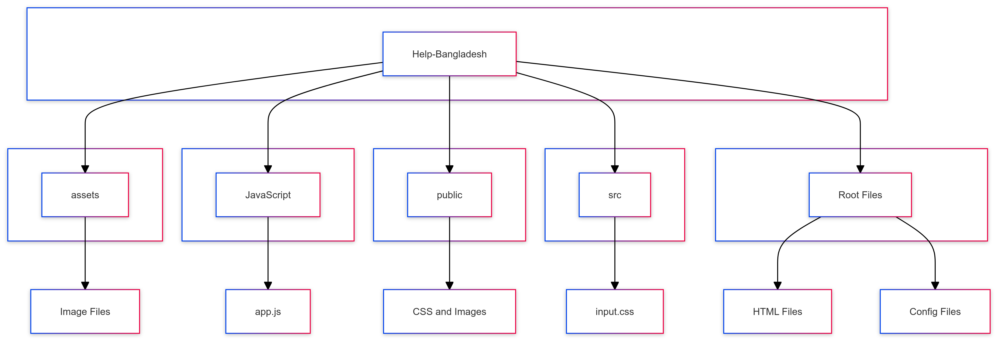

# [Help Bangladesh: Together We Can Rebuild](https://help-bangladesh.netlify.app/)

[](https://github.com/TheToriqul/help-bangladesh)
[](https://github.com/TheToriqul/help-bangladesh/stargazers)

**Help Bangladesh: Together We Can Rebuild** is a donation platform to support flood victims in Bangladesh. This web app is designed for transparent and easy contributions towards relief efforts, providing essential aid to communities in need.

The **Help Bangladesh** project was created to provide a reliable, user-friendly platform for raising funds to help victims of the floods in Bangladesh. This platform enables global contributors to support critical relief efforts such as providing clean water, shelter, and medical aid.

## System Architecture Diagram



## ✨ Features
- 💰 **Easy-to-use donation interface**: Donors can make contributions with just a few clicks.
- ⚡ **Real-time balance updates**: Keep track of donation milestones and overall progress.
- 📊 **History tracking**: View your donation history and contributions.
- 📱 **Responsive design**: Optimized for both mobile and desktop users.

## 🎥 Demo

Visit the live demo here: [Help Bangladesh Website](https://help-bangladesh.netlify.app/)

## 🛠️ Technologies Used
- 
- 
- 
- 
- 


## 🗂️ Sections
- **Donation Form**: A simple interface for contributors to donate to various relief efforts.
- **Balance Tracker**: Displays real-time updates on total donations and goals.
- **Donation History**: A history section for tracking previous contributions.

## 🚀 Getting Started

### ✅ Prerequisites
Ensure you have the following installed:
- Node.js
- Git

### 🛠️ Installation

Follow these steps to get a local copy running:

```bash
# Clone the repository
git clone https://github.com/TheToriqul/help-bangladesh.git

# Navigate to the project directory
cd help-bangladesh

# Install dependencies
npm install

# Start the development server
npm run dev
```

## 💡 Usage
Once the development server is running, you can access the application in your browser at `http://localhost:3000`. 

## 🚧 Future Enhancements
- Integration with payment gateways like Stripe or PayPal for seamless donations.
- Multi-language support to cater to global users.
- Real-time notifications for donation confirmations.

## 💼 How I Use This Repo
This repository serves as the central hub for the Help Bangladesh project. Here's how I typically work with it:

1. **🌿 Development**: I use the `main` branch for stable releases and create feature branches for new developments.
2. **🧪 Testing**: Before merging new features, I thoroughly test them locally and on different devices to ensure compatibility.
3. **🚀 Deployment**: After merging feature branches and ensuring everything works correctly, I deploy the updates to the live site.
4. **🐛 Issue Tracking**: I use GitHub Issues to track bugs, feature requests, and project tasks.
5. **📚 Documentation**: I keep the README and other documentation up-to-date with each significant change or new feature.
6. **🔍 Version Control**: I make regular commits with clear, descriptive messages to maintain a clean and understandable project history.

## 🤝 Contributing
Contributions, issues, and feature requests are welcome! Feel free to check [issues page](https://github.com/TheToriqul/help-bangladesh/issues) if you want to contribute.

1. Fork the Project
2. Create your Feature Branch (`git checkout -b feature/AmazingFeature`)
3. Commit your Changes (`git commit -m 'Add some AmazingFeature'`)
4. Push to the Branch (`git push origin feature/AmazingFeature`)
5. Open a Pull Request

## 📞 Contact
For any questions or inquiries regarding the project, please feel free to contact me:
- 📧 Email: toriqul.int@gmail.com
- 📱 Phone: +65 8936 7705, +8801765 939006

## 🌐 Project Links
- [GitHub Repository](https://github.com/TheToriqul/help-bangladesh)
- [GitHub Pages](https://thetoriqul.github.io/Help-Bangladesh/)
- [Netlify App](https://help-bangladesh.netlify.app/)

---

Copyright © 2024 TheToriqul. All Rights Reserved. 
This work is licensed under the [Creative Commons Public License](./LICENSE). 